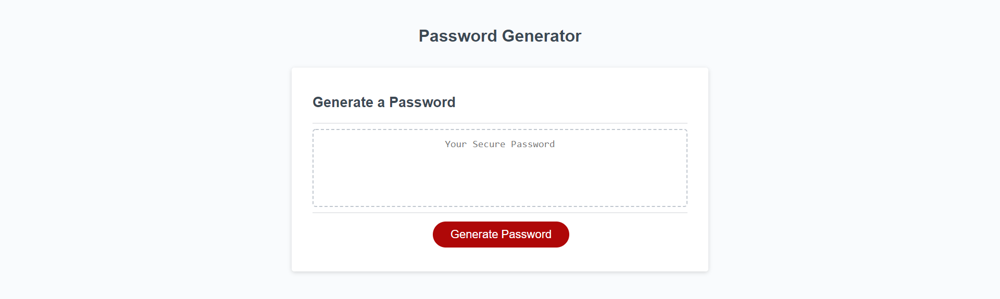

# Password Generator

## Description
This repository contains a password generator webpage. The password generator provides users with a variety of options to customize the contenet of any generated passwords, and then returns a password that meets the given criteria.

Technologies used include HTML, CSS, and Javascript.

## Features
* When "Generate Password" is clicked, the user will be prompted to customize the generated password
* User is asked for length from 8 to 128 charachters
* User is presented with options for which character types to include. Character type options:
    * lowercase letters
    * uppercase letters
    * numeric characters
    * special characters
* User input is validated to insure proper functionality

## Links

[Deployed website](https://wgrout87.github.io/Password-Generator/)

[Code repository](https://github.com/wgrout87/Password-Generator)

## Usage
This repository contains a password generator webpage, which can be viewed on a variety of devices as it has been configured for multiple screen dimensions. Upon clicking the "Generate Password" button, the user must input a whole number value from 8 to 128 to establish the length of the generated password. If an invalid value is entered, the user will be prompted to enter an appropriate value. The user must then chose between four sets of characters to be included in the generated password. If no character set is chosen, the user will be prompted that at least one option must be chosen and will be presented with the options again. Once valid options have been selected, a new password will be generated that meets the selected criteria.

The deployed website should resemeble the following screenshot.

## Credits
The HTML and CSS content, as well as a small but important portion of the JavaScript was provided by the University of Utah Coding Bootcamp.